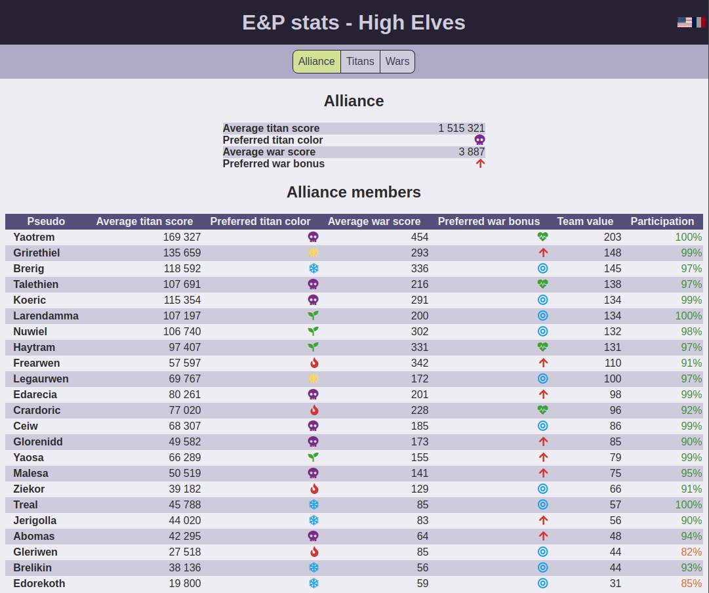
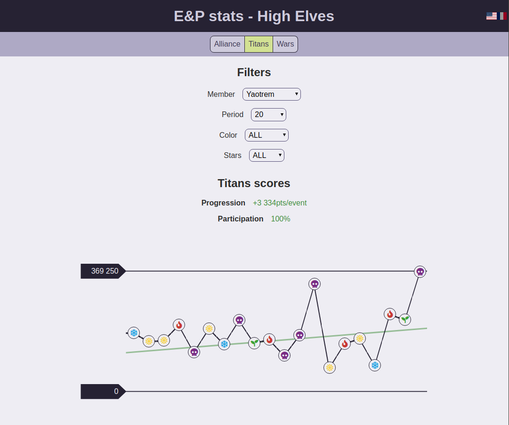

# ep-stats

> Highly experimental statistics extractor for the game Empires & Puzzles (available on [Android](https://play.google.com/store/apps/details?id=com.smallgiantgames.empires) & [iOS](https://itunes.apple.com/app/id1117841866)).

<!-- TOC START -->

* [Disclaimer](#disclaimer)

* [What it does](#what-it-does)

* [Sneak peek](#sneak-peek)

  * [Alliance page](#alliance-page)
  * [Members page](#members-page)

* [How it does it](#how-it-does-it)

* [Limitations](#limitations)

  * [OS](#os)
  * [Screenshot size](#screenshot-size)

* [Pre-requisites](#pre-requisites)

* [Installation](#installation)

* [Initialization](#initialization)

  * [Google project creation](#google-project-creation)
  * [Add Photos and Calendar APIs](#add-photos-and-calendar-apis)
  * [Rename your project](#rename-your-project)
  * [Retrieve your credentials](#retrieve-your-credentials)

* [How to run it](#how-to-run-it)

  * [Pre-requisites](#pre-requisites-1)

  * [Create the spreadsheet](#create-the-spreadsheet)

    * [Add members](#add-members)
    * [Wars](#wars)
    * [Titans](#titans)

  * [Upgrade ep-stats](#upgrade-ep-stats)

* [Roadmap](#roadmap)

  * [DONE](#done)
  * [TODO](#todo)

<!-- TOC END -->

## Disclaimer

I am not linked to small giant games (game developer) in any way.

This project is experimental and developed for the fun on my free time.

I develop it at thought-speed and only test by using it daily.

I'd be thrilled to see others use it but please don't judge me by its quality.

## What it does

As a serious E&P player, I wanted to get insights into how my alliance — and its members — fares in wars and against titans.

The only summary the games gives you is an un-copiable message in the alliance chat. If you think that this is really sad, please vote up [the issue raised on the game's forum](https://forum.smallgiantgames.com/t/better-titan-attack-stats-show-number-of-flags-used-attacks-made-in-addition-to-score/1253).

This project takes a screenshot of the results, uses [OCR](https://en.wikipedia.org/wiki/Optical_character_recognition) to retrieve the information as text and pushes it on a GSheet.

Then you can use [the front-end application](https://ep-stats.netlify.com) to view the stats.

## Sneak peek

This is what the stats look like in the application.

### Alliance page



### Members page



## How it does it

This project contains a CLI tool that fetches the screenshots from [Google photos API](https://developers.google.com/photos/), parses them, and pushes the parsed stats on a pre-configured Google Sheet.

It uses [Tesseract JS](https://tesseract.projectnaptha.com/) to get the information from the image and the [Google Sheets API](https://developers.google.com/sheets/api/) to push the stats.

The processing done on the screenshots happens in a few steps:

* crop the title area
* read it with OCR
* guess the screenshot's type from the title (hits are retrieved from the `CHAT`, titan information from `TITAN_HUNT`, and war information from `ALLIANCE`)
* then crop all the areas where the interesting information is and analyze them one by one to gather all the information required for the stats (these areas differ from a screenshot type to another, that's why the type is guessed first)

Before performing OCR, the images are cropped and a threshold applied using [JIMP](https://github.com/oliver-moran/jimp) because OCR works best on black&white images.

## Limitations

### OS

This tool has only been tested on Linux (tried on Linux mint 17-19 and Ubuntu 18).

MacOS being Unix-based, it _should_ be able to run it but there's no guarantee whatsoever.

I have removed all the parts that I know can cause issues on Windows but I have never tested it and I doubt it works (making a CLI tool this complex work on Windows without testing it would be a hell of a luck). Feel free to create issues if you spot a bug but I'll need someone to test it.

### Screenshot size

The program currently only supports the definition 1536x2048 (iPad mini).

You can add your own profile in the folder `lib/image-processing/profiles` like it was done for the iPad resolution.

This implies copying the file `lib/image-processing/profiles/1536x2048.js` to a file named `${WIDTH}x${HEIGHT}.js` and modifying the values to fit your resolution.

You also need to register it in `lib/image-processing/profiles/availableProfiles.js`.

More information about how to find the values [here](doc/screenshot_profiles.md).

## Pre-requisites

* [NodeJS](https://nodejs.org/) version 10 or more
* A Google account (I recommend using a specific one for this application for privacy reasons but you can do what you like)
* Some patience (the installation process is a bit long)

## Installation

```shell
npm install --global @quilicicf/ep-stats
```

## Initialization

### Google project creation

This tool requires a Google project to access Google APIs.

__MAKE SURE YOU ARE CONNECTED WITH THE RIGHT GOOGLE ACCOUNT FIRST, THEN PROCEED__

You can create a Google project by following the Step 1 of the [Google Sheets quickstart guide](https://developers.google.com/sheets/api/quickstart/nodejs).

Click on `Enable the Google Sheets API` and select `Desktop app`.

You now have a Google project with Google Sheets API activated :tada:

This is far from enough though, you'll also need at least the Google Photos API to be associated with your project and the Google Calendar API too if you want to use the [holidays feature](#holidays).

### Add Photos and Calendar APIs

Head to the [Google dev console's library page](https://console.developers.google.com/apis/library) and enable the Photos and Calendar APIs.

### Rename your project

The project was named `Quickstart` because Google's quickstart wizard created it for you. You can rename it by opening the [dev console's dashboard page](https://console.developers.google.com/apis/dashboard), clicking on the `⋮` menu icon next to you Google account's avatar and selecting `Project settings`.

### Retrieve your credentials

When all this is done, you can download the credentials file from the [credentials page](https://console.developers.google.com/apis/credentials). In section `OAuth 2.0 Client IDs`, click on the download button at the end of the line.

You can now run:

```shell
ep-stats initialize
```

And copy the file you just downloaded where the tool tells you to.

## How to run it

### Pre-requisites

You'll need to install

* [tesseract](https://github.com/tesseract-ocr/tesseract/wiki)
* [imagemagick](https://www.imagemagick.org/script/download.php)
* [NodeJS](https://nodejs.org/en/download/)
* [git](https://github.com/git/git)

### Create the spreadsheet

Create a google spreadsheet from your google account.

You can either create it from scratch or copy [this demo sheet](https://docs.google.com/spreadsheets/d/10y4Y1UDsxU05lxI8KTaq1QVxtWtbYm5Kh7kMjbjNtAM/edit#gid=1902473722) and edit it.

> :warning: You'll need to keep this spreadsheet up-to-date when a new player joins in! Otherwise his stats won't be added. The too will just push incomplete data to the Google Sheet.

#### Add members

Create a sheet named `Members` that looks like this:

|     | A                |
| --- | ---------------- |
| 1   | __Pseudo__       |
| 2   | PseudoOfPlayer1  |
| 3   | PseudoOfPlayer2  |
| 4   | PseudoOfPlayer3  |
| 5   | PseudoOfPlayer4  |
| ... | ...              |
| 30  | PseudoOfPlayer30 |

#### Wars

Create a sheet name `Wars` that looks like the example below. Only create the header row, the rest will be created by the program (the second line is here to show an example of the data).

The order of the members pseudos must be the same as in the sheet `Members`.

| A            | B         | C               | D         | E           | F                   | G                   | H       |
| ------------ | --------- | --------------- | --------- | ----------- | ------------------- | ------------------- | ------- |
| __War date__ | __Total__ | __Enemy score__ | __Bonus__ | __Members__ | __PseudoOfPlayer1__ | __PseudoOfPlayer2__ | __...__ |
| 24_12        | 2456      | 3201            | ARROWS    | 27          | 123                 | 437                 | ...     |

#### Titans

Create a sheet name `Titans` that looks like the example below. Only create the header row, the rest will be created by the program (the second line is here to show an example of the data).

The order of the members pseudos must be the same as in the sheet `Members`.

| A              | B         | C        | D         | E         | F           | G                   | H                   | ...     |
| -------------- | --------- | -------- | --------- | --------- | ----------- | ------------------- | ------------------- | ------- |
| __Titan date__ | __Total__ | __Life__ | __Stars__ | __Color__ | __Members__ | __PseudoOfPlayer1__ | __PseudoOfPlayer2__ | __...__ |
| 24_12          | 1327000   | 1327000  | 6         | HOLY      | 27          | 77000               | 144524              | ...     |

### Upgrade ep-stats

You just need to use the same command as for the installation.

```shell
npm install --global @quilicicf/ep-stats
```

## Roadmap

### DONE

| Item                                                                                                          | Implementation date |
| ------------------------------------------------------------------------------------------------------------- | ------------------- |
| Add full alliance stats (only member performance was added)                                                   | 2018_12             |
| Add war bonus in stats                                                                                        | 2018_12             |
| Add war date selector                                                                                         | 2019_01             |
| Add war enemy score in stats                                                                                  | 2019_01             |
| Add titans page                                                                                               | 2019_01             |
| Retrieve member's list from the GSheet                                                                        | 2019_01             |
| Detect defeated titans if their life can't be guessed from the screenshot (in case it was taken after defeat) | 2019_XX             |
| Add a demo gsheet to copy instead of long instructions                                                        | 2019_XX             |
| Better logs for pushed data                                                                                   | 2020_04             |

### TODO

> The order below does not indicate priority, there's no guarantee that any of this will even be done one day

* [ ] Auto-create screenshot profiles
* [ ] Push to npm
* [ ] Create a post on small giant forum
* [ ] Fail when there are more members parsed than present on the spreadsheet
* [ ] Try to validate scores (see what's doable)
