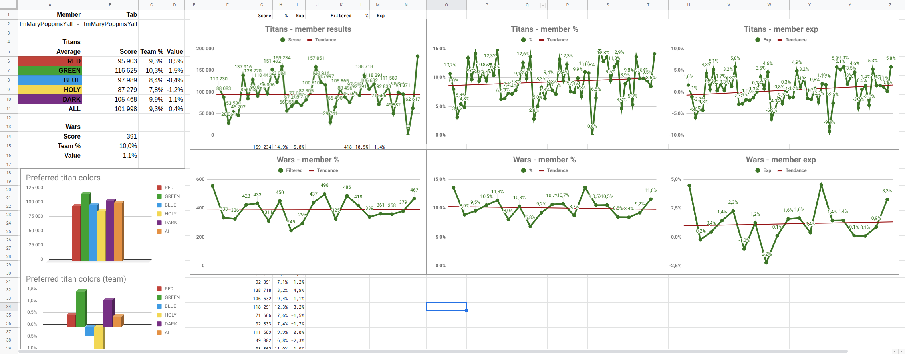
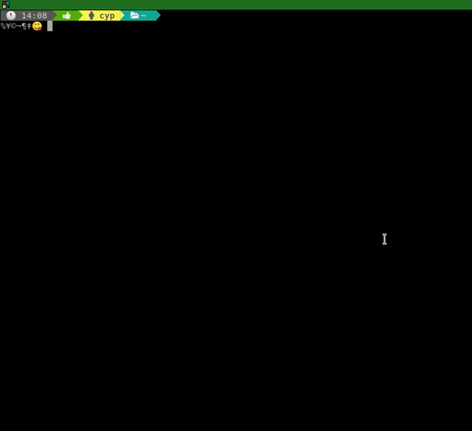

# ep-stats

> Highly experimental statistics extractor for the game Empires &amp; Puzzles (available on [Android](https://play.google.com/store/apps/details?id=com.smallgiantgames.empires) & [iOS](https://itunes.apple.com/app/id1117841866)).

## Disclaimer

I am not linked to small giant games (game developer) in any way.

This project is experimental and developed for the fun on my free time.

It is written at thought-speed and not tested.

I'd be thrilled to see others use it but please don't judge me by it's quality XD.

## What it does

As a serious E&P player, I wanted to get insights into how my alliance - and its members - fares in wars and against titans.

The only summary the games gives you is a message in the alliance chat.

This project takes a screenshot of the results, [OCR](https://en.wikipedia.org/wiki/Optical_character_recognition)'s it to retrieve the information as text and pushes it on a GSheet where it can be analyzed.

## How it does it

The project contains a CLI tool that lets the user select screenshots and extracts the relevant information before pushing it on a pre-configured gsheet.

It uses [tesseract](https://github.com/tesseract-ocr/tesseract/wiki) to get the information from the image and the GSheet API to push the stats on a GSheet.

It also uses [imagemagick](https://www.imagemagick.org/) to pre-process the images before feeding them to tesseract. The manipulations done are basically extracting parts of the image and threshold-ing it because OCR works way better on black and white.

## Limitations

### Linux-only

This tool currently only runs on Linux. This is due to the fact that tesseract currently only runs on linux. It _can_ be used on mac but I've never tried it and don't own a genius' laptop.

Windows is off-limits too ATM.

This may change if someone is interested in helping me make the program run on other platforms. It would involve plugging in another OCR tool for windows and switching the image conversions to JS native (which should be easy-enough using [Jimp](https://www.npmjs.com/package/jimp) though).

### Screenshot size

The program currently only supports the definition 1536x2048 (iPad mini).

You can add you own profile in the folder `lib/image-processing/profiles` like it was done for the iPad resolution.

This implies copying the file `lib/image-processing/profiles/1536x2048.js` to a file named `${WIDTH}x${HEIGHT}.js` and modifying the values to fit your resolution. 

You also need to register it in `lib/image-processing/profiles/availableProfiles.js`.

More information about how to find the values [here](doc/screenshot_profiles.md).

## Usage

How I use it:

* I screenshot titan info (as soon as a titan appears), war info (when the war is over to have the enemy score) and hit info (from the chat). More info about what to screenshot and how [here](./doc/screenshot_profiles.md)
* The screenshots are synced (via google photos for me, use any solution you like) to my laptop (all in a single folder!)
* Once in a while, I use ep-stats to process the screenshots and upload the stats to my spread sheet.

## Sneak peak

### What do stats look like?



### CLI tool usage



## How to run it

### Pre-requisites

You'll need to install

* [tesseract](https://github.com/tesseract-ocr/tesseract/wiki)
* [imagemagick](https://www.imagemagick.org/script/download.php)
* [NodeJS](https://nodejs.org/en/download/)
* [git](https://github.com/git/git)

### Create the spreadsheet

Create a google spreadsheet from your google account.

> :warning: You'll need to keep this spreadsheet up-to-date when a new player joins in! Otherwise his stats won't be added. I have plans to make the program yell at users when that occurs but currently, it'll just push incomplete data to the gsheet.

#### Add members

Create a sheet named `Members` that looks like this:

|Pseudo|
|---|
|PseudoOfPlayer1|
|PseudoOfPlayer2|
|PseudoOfPlayer3|
|PseudoOfPlayer4|
|...|
|PseudoOfPlayer30|

#### Wars

Create a sheet name `Wars` that looks like the example below. Only create the header row, the rest will be created by the program (the second line is here to show an example of the data).

The order of the members pseudos must be the same as in the sheet `Members`.

|War date|Total|Enemy score|Bonus|Members|PseudoOfPlayer1|PseudoOfPlayer2|...|
|---|---|---|---|---|---|---|---|
|24_12|2456|3201|ARROWS|27|123|437|...|

#### Titans

Create a sheet name `Titans` that looks like the example below. Only create the header row, the rest will be created by the program (the second line is here to show an example of the data).

The order of the members pseudos must be the same as in the sheet `Members`.

|Titan date|Total|Life|Stars|Color|Members|PseudoOfPlayer1|PseudoOfPlayer2|...|
|---|---|---|---|---|---|---|---|---|
|24_12|1327000|1327000|6|HOLY|27|77000|144524|...|

#### Analyse the data

You can analyse it the way you want, ep-stats will just feed the sheets above. Add any other sheet you like and hack away! 

I'll explain my configuration here when I get the time.

### Configure the spreadsheet

You need to give ep-stats access to Google's API on your account so that it can push to the spreadsheet. This is done once at first run then stored for later use.

```shell
# Install ep-stats
git clone git@github.com:quilicicf/ep-stats.git
cd ep-stats
npm link # Will be uploaded to npm when stable enough

# At first launch only, allow ep-stats to push on your spreadsheet
# When your internet browser opens, log in to the account with which you created the sheet of course
npm run bootstrap

# Get the value of SHEET_ID from the URL of your sheet that looks like this:
# https://docs.google.com/spreadsheets/d/$SHEET_ID/edit#gid=0
# It is only required at first launch and will be stored in ./config.json
# You'll need it in next section
```

### Run the program

```shell
# The first time, you will be asked for the sheet id and 
# for the path to the folder where you put your screenshot
ep-stats
```

### Upgrade ep-stats

To upgrade ep-stats, you need to pull the latest `master`. 

```shell
cd $EP_STATS_REPO_PATH
git fetch
git pull
```

> Needless to say, you should stay on master at all times

## Roadmap

### DONE

|Item|Day of implementation|
|---|---|
|Add full alliance stats (only member performance was added)|2018_12_28|
|Add war bonus in stats|2018_12_29|
|Add war date selector|2019_01_07|
|Add war enemy score in stats|2019_01_07|
|Add titans page|2019_01_13|
|Retrieve member's list from the GSheet|2019_01_13|

### TODO

> The order below does not indicate priority

- [ ] Better logs for pushed data (currently badly formatted list)
- [ ] Add a dummy gsheet to copy instead of long instructions
- [ ] Auto-create screenshot profiles
- [ ] Push to npm
- [ ] Create a post on small giant forum
- [ ] Fail when there are more members parsed than present on the spreadsheet
- [ ] Don't show already parsed images? (not sure about this one)
- [ ] Try to validate scores (see what's doable)
