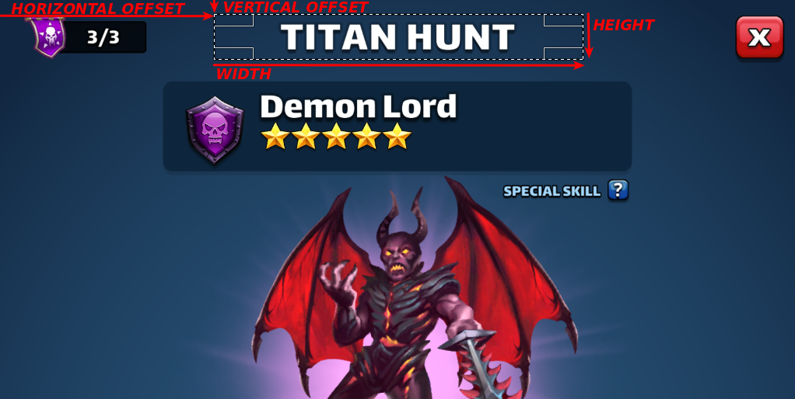
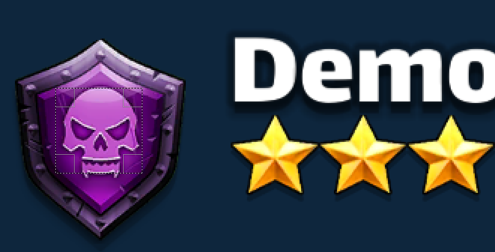
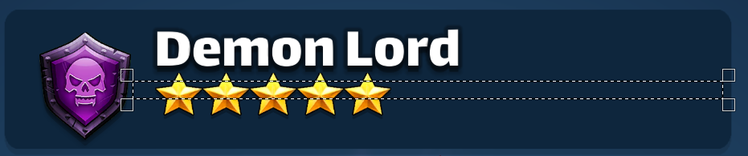
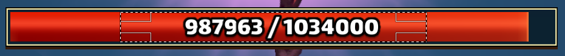
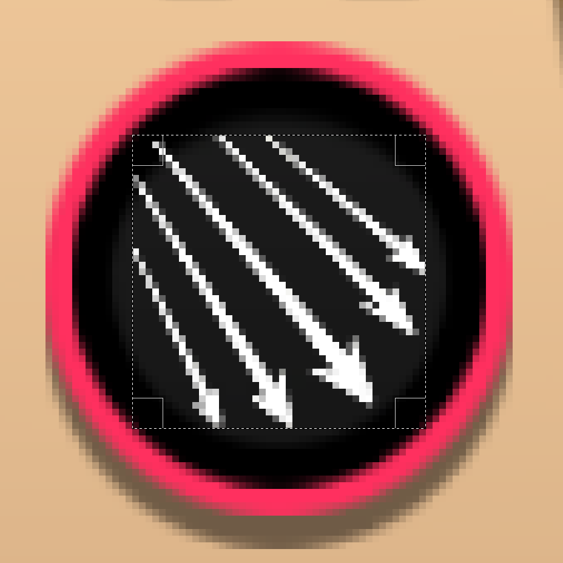
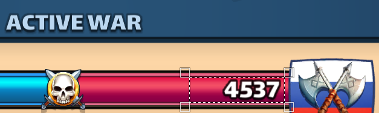

# Screenshot profiles

Some parts of the screenshots are processed to retrieve specific information. Here is the breakdown.

> Note: the values of `verticalOffset`, `horizontalOffset`, `width` and `length` should be expressed in pixels.

> Note 2: they are not expressed in percentage without the need for profiles because I don't know how responsive the design of these pages is.

## All

To find out which screenshot represents what, the header is read. This corresponds to `$.global.header` in the profile files.

Configure as shown below:

Depending on what's is read in the header, the screenshot is recognized by ep-stats as one of the three categories below.

## Titan info

The information that is retrieved from the titan's info page is:

* its color
* the number of stars
* its full life

:warning:
 
__The screenshot MUST be taken from the attack page, NOT the alliance's page (click on `attack` to reach the right page). Keep a titan flask to be able to access that page at all times.__

:warning:

### Titan color

The extracted part must be a perfect square, fully inside the emblem, as shown below.

The titan color is extracted from that image by computing the mean color of the extracted image and comparing it with the known titan colors.

### Titan stars

The extract part must be a rectangle whose top line crosses the top of all the stars in the image, as shown below.

The stars number is computed by thresholding the picture like shown below and counting the number of black areas in the top row of the image.

### Titan life

The life is extracted by OCR-reading the life of the titan, extracted as shown below.

> Note: for easier reading, the image is thresholded beforehand.

> Note2: I could only read the right side in the future. I had hopes of getting the remaining life at first but it means screen-shooting the page between two titans which can occur at times I'm not able to take screenshots.

## War info

The information that is retrieved from the war's info page is:

* the war bonus
* the enemy score

### War bonus

The extract part must be a perfect square taken _inside_ the red circle as shown below.

The image is scaled down to 24x24 and compared pixel-by-pixel to reference images to guess the bonus. The expected images can be found [here](../lib/image-processing/war/bonuses).

### War enemy score

The enemy score is extracted via OCR from the part shown below.

## Hits

The hits are retrieved from the alliance chat. Just post a screenshot that contains all the scores of you team __and only the scores for one activity!__ If there is a mix of scores from titan & war in the screenshot, ep-stats can't currently guarantee what's gonna get extracted.

No extraction is done for hits info.
